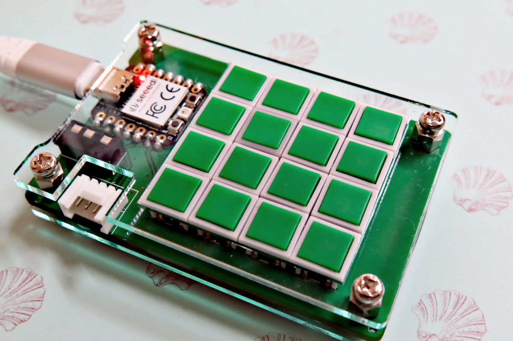
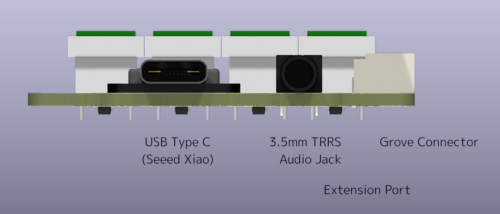

Xiaolu Keyboard
===============

この Xiaolu Keyboard は、Seeed Xiao を使用した小型の自作キーボードです。このキーボードは、テンキーやゲーム用のマクロキーボードなどとして使用できる、コンパクトで手のひらサイズのデバイスとして設計されています。キーボードには、4×4グリッドに配置された合計16個の小さなキーが使用されています。

このキーボードを作るには、基本的なハンダ付けの技術と工具、そしてSeeed Xiao用にファームウェアをビルドしてインストールする必要があります。必要なものがすべて揃ったら、ビルドガイドを参照してください。

キーボードの組み立てに成功したら、ArduinoやQMKなどのファームウェアを使って、独自のマクロやカスタム機能でキーボードをプログラムすることができます。Arduinoのサンプルファームウェアでは、例としてシンプルな4x4のテンキー機能を提供しています。

## 特徴

* 秋月C基板互換サイズでコンパクトで手のひらサイズ (51mm x 76mm)
* Switronic TS-AGGNH-G プッシュボタンの採用により小型ながらもキースイッチの押しやすさを両立
* MCU として Seeed XIAO を採用

## 手順書

* [パーツリスト](docs/bom.md)
* [ビルドガイド](docs/building_instruction.md)
* [拡張機能](docs/extensible_features.md)

## 外観図

## License

licensed under the [CC-BY-SA-4.0](https://creativecommons.org/licenses/by-sa/4.0/) except for QMK.
QMK firmware source code is licensed under the [GPLv2](https://www.gnu.org/licenses/old-licenses/gpl-2.0.html)
