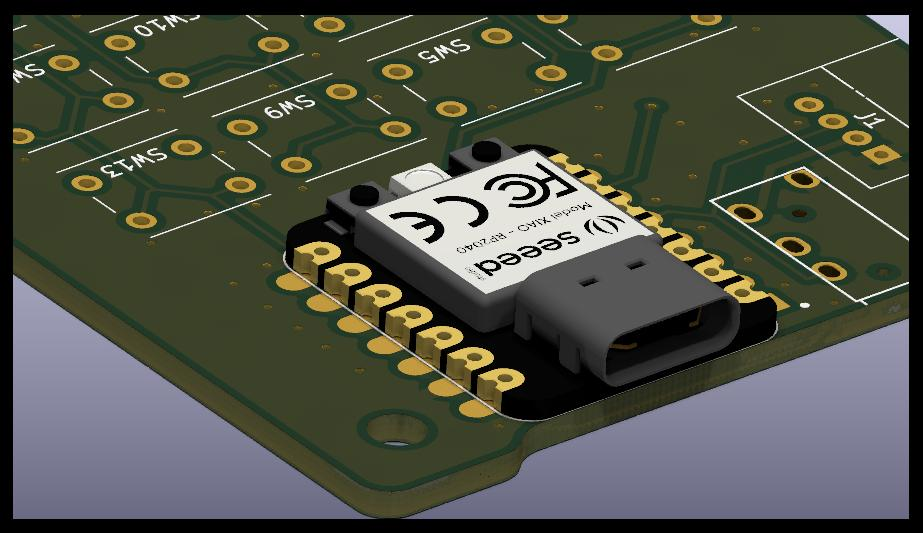
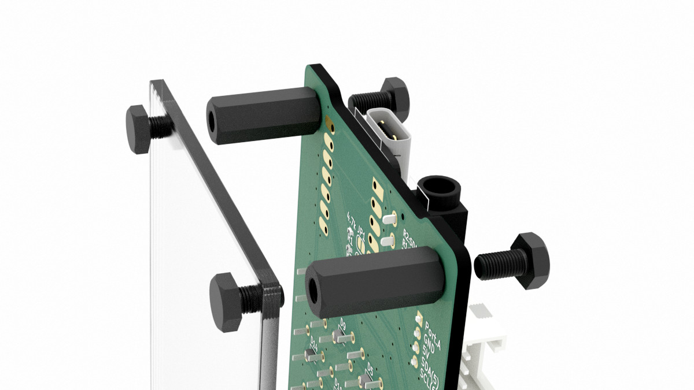

ビルドガイド
============

## PCB 実装

### ステップ 0

ダイオードや抵抗がPCB+SMT製造サービスによって既に実装されている場合は、このステップをスキップしてください。

* 16 x 1N4148 Diodes (D1-D16)
* 2 x 4.7kΩ 0402 Resistor (R1, R2)

これらのダイオードは方向性があります。カソードが左、アノードが右です。

### ステップ 1

* Seeed Xiao RP2040 (U1)

PCB上にSeeed Xiaoボードを置き、Seeed Xiaoの端面スルーホールととPCB上の対応するパッドが以下の3D CGのように一致するようにします。

それぞれの端面スルーホールをとパッドをはんだ付けします。

補足：また、プリント基板にはスルーホールが設けられています。これは位置合わせのために使うこともできますし、強度を増すなどの理由があればスルーホールをハンダ付けすることも可能です。

### ステップ 2

* 1 x TRRS ジャック PJ-320A(または MJ-4PP-9) (TRRS)

TRRS拡張用オプション部品です。不要な場合はこのステップをスキップしてください。

TRRSジャックをPCBに挿入してテープで固定します。フットプリントがぴったり合うように作られているので、きちんと押し込んでください。PCBを裏返します。ピンをはんだ付けします。テープを剥がします。

### ステップ 3

* 1 x GroveコネクタL型スルーホール (J1)

Grove拡張用オプション部品です。不要な場合はこのステップをスキップしてください。

GroveコネクタをPCBにテープで固定します。PCBを裏返します。ピンをはんだ付けします。テープを剥がします。

### ステップ 4

* 16 x Switronic TS-AGGNH-G プッシュボタン (SW1-16)

プッシュボタンをPCBにテープで固定します。PCBを裏返します。ピンをはんだ付けします。テープを剥がします。

## ケース

### 最も安価なケースセットアップ〜市販品の利用〜

下図のようにして、アクリルパネルをスペーサーとプラネジで固定します。

### サンドイッチマウントケース

未設計

## ファームウェア

### Arduino

未実装

### QMK

未実装
