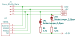

拡張機能
========

この Xiaolu Keyboard には、オプショナルなパーツとして Grove コネクタおよび TRRS ジャックをつけることができます。これらのインタフェースを介して他のユニットと接続し、ファームウェアを適切に実装することで、キーボードの機能を拡張することができます。

## 配線

Grove コネクタおよび TRRS ジャックは下記の通り接続されます。

|Seeed Xiao RP2040 Pin|Grove(M5Stack互換)|TRRS  |
|---------------------|------------------|------|
|GND                  |1 (Black/GND)     |Sleeve|
|5V                   |2 (Red/5V)        |Tip   |
|P6/SDA/D4            |3 (Yellow/SDA)    |Ring2 |
|P7/SCL/D5            |4 (White/SCL)     |Ring1 |



Grove コネクタと TRRS ジャックの電源供給は、どちらも 5V が供給されます。

I2C のプルアップは、3.3V に 4.7 kΩの抵抗を接続するのが標準です。
4.7 kΩの抵抗が PCB に実装されていますので、ハンダブリッジジャンパで有効にすることで、このプルアップすることができます。

I2C のプルアップ抵抗は、4.7 kΩが標準値ですが、必要に応じて変更してください。

## ファームウェア

### I2C -- Arduino/PlatformIO

RP2040 の標準の I2C 用途のピンを使っているので、ArduinoのWireライブラリの関数を使用して I2C デバイスにアクセスできます。
すなわち、 `Wire.begin()` 関数を使用して I2C バスを初期化し、 `Wire.write()` 関数を使用して I2C デバイスにデータを送信し、あるいは `Wire.read()` 関数を使用してデータを受信できます。

Wireライブラリの使い方の詳細については、[Arduino の Wireライブラリの公式ドキュメント](https://www.arduino.cc/reference/en/language/functions/communication/wire/)を参照してください。

```c++
#include <Wire.h>

void setup() {
  // ...
  Wire.begin();
  // ...
}

void loop() {
  Wire.requestFrom(device_address, 1);
  while (Wire.available()) {
    // Wire.read();
    // ...
  }
  // ...
}
```


### I2C -- QMK

QMKでI2Cを使用するには、以下の設定が必要です。

**rules.mk**: `QUANTUM_LIB_SRC` に `i2c_master.c` を追加します。

```make
QUANTUM_LIB_SRC += i2c_master.c
```

**halconf.h**: `HAL_USE_I2C` を `TRUE` に設定します。

```c++
#pragma once

#define HAL_USE_I2C TRUE

#include_next <halconf.h>
```

**mcuconf.h**: `RP_I2C_USE_I2C1` を `TRUE` に設定します。使わない `RP_I2C_USE_I2C0` は `FALSE` に設定します。

```c++
#pragma once

#include_next <mcuconf.h>

#undef RP_I2C_USE_I2C0
#undef RP_I2C_USE_I2C1
#define RP_I2C_USE_I2C0 FALSE
#define RP_I2C_USE_I2C1 TRUE
```

**config.h**: 以下の設定を追加します

* `I2C_DRIVER` は、I2Cドライバの種類として I2C1 を指定します。
* `I2C1_SCL_PIN` と `I2C1_SDA_PIN` は、I2C1のSCL/SDAピンを指定します。それぞれ `GP7`, `GP6` を指定します。

```c++
#pragma once

// I2C
#define I2C_DRIVER I2CD1
#define I2C1_SCL_PIN GP7
#define I2C1_SDA_PIN GP6
```

これらの設定を行った後、I2Cデバイスを操作できるようになります。

**keymap.c**: 例えば下記のようにして I2C デバイスを制御します。

* `keyboard_post_init_user()` で `i2c_init()` を呼ぶことで I2C ドライバを初期化します。
* `matrix_scan_user()` で I2C デバイスの処理を行います。
* [QMKのI2CドライバのAPI](https://github.com/qmk/qmk_firmware/blob/master/docs/i2c_driver.md#api-idapi)関数群を使って I2C デバイスと通信を行います。

```c++
static void handle_i2c_device(void) {
    static const uint16_t TIMEOUT = 100;

    uint8_t c[1] = {0};
    const i2c_status_t error = i2c_receive(I2C_DEVICE_ADDR << 1, c, sizeof(c), TIMEOUT);
    if (error != I2C_STATUS_SUCCESS) {
        return; // quit on failure
    }

    // ...
}

void matrix_scan_user(void) {
    // ...
    handle_i2c_device();
}

void keyboard_post_init_user(void) {
    // ...
    i2c_init();
}
```
